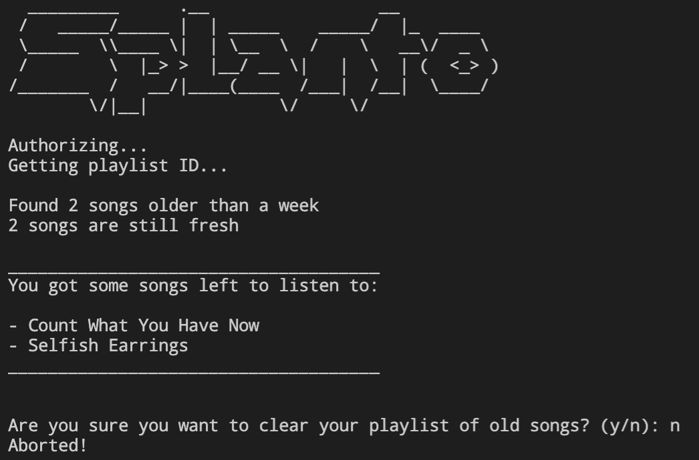

# SplanTo
SplanTo automatically removes tracks older than one week from your Spotify playlist `(default: description='Plan to hear')`, keeping it fresh and manageable.

## Preview

## Installation & Setup:

### Requirements
- Python 3.x
- spotipy

### Environment variables:
- SPLANTO_CLIENT_ID
- SPLANTO_CLIENT_SECRET

Run: `python SplanTo.py`
